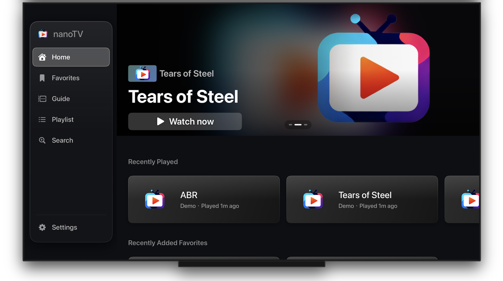

# NanoTV - Professional Media Player

  <a href="README.zh-CN.md">🇨🇳 简体中文</a>

  

  

**NanoTV** is a feature-rich, high-performance media player designed for **macOS, Apple TV, iPhone, and iPad**. We are dedicated to providing the best viewing experience, combining powerful features with a clean interface design.

🌐 **Website**: [nanotv.app](https://nanotv.app)

---

## ✨ Features

### 🚀 Core Experience
- **Multi-Platform**: Seamlessly sync subscriptions and settings via **iCloud** across macOS, iOS and tvOS.
- **macOS Optimized**: Brand-new UI design for macOS with a stunning EPG interface for easy program browsing.
- **Hardware Acceleration**: Supports H.264/H.265 encoding for smooth HD playback.
- **Modern UI**: Full support for Light, Dark, and System modes.

### 📺 Playback & Sources
- **Flexible Subscriptions**: Supports **M3U**, **TXT**, **Xtream Codes API**, **Stalker Portal**, and **TVHeadend**.
- **All-Channel Search**: Fuzzy matching across all channels, plus exact search by wrapping the query in double quotes `""`.
- **Custom Subscription Ordering**: Drag and reorder your subscriptions in edit mode.
- **Remote Management**: Manage playlists remotely via phone or computer.
- **EPG Support**: Electronic Program Guide with automatic translation (English ↔ Chinese).

### 🤖 AI & Accessibility
- **Real-time Subtitles**: AI-driven speech-to-text (English, Spanish, German, French, Italian).
- **Live Translation**: Real-time translation of subtitles.
- **On-Device Translation** *(tvOS)*: Private, offline subtitle translation powered by a bundled model — no network required (English → Chinese).

---

## 📥 Download

| Platform | Version | Link |
|----------|---------|------|
| **macOS** (Stable) | 1.3.13 | [Download on App Store](https://apps.apple.com/us/app/nanotv/id6754768796) |
| **iOS** (Stable) | 1.2.36 | [Download on App Store](https://apps.apple.com/us/app/nanotv/id6754768796) |
| **tvOS** (Stable) | 1.2.35 | [Download on App Store](https://apps.apple.com/us/app/nanotv/id6754768796) |
| **TestFlight** (Beta) | — | Temporarily unavailable |

---

## 📝 Release Notes

### Latest Release: macOS v1.3.13 · tvOS v1.2.35 · iOS v1.2.36

  

#### 🖥️ macOS v1.3.13

✅ **Improvements**
- Added Favorite and Sound toggle buttons to the playback interface.

✅ **New Features**
- **Custom Subscription Ordering**: Enter edit mode to drag and reorder your subscriptions.
- **All-Channel Search**: Fuzzy matching supported; wrap your query in double quotes `""` for an exact search — finding channels has never been easier.

#### 📺 tvOS v1.2.35

✅ **Improvements**
- **Redesigned UI & Interaction**: An immersive visual and interaction design tailored for tvOS, making big-screen navigation smoother than ever.
- **Performance Boost**: Optimized performance with reduced stutter.

✅ **New Features**
- **All-Channel Search**: Fuzzy matching supported; wrap your query in double quotes `""` for an exact search — finding channels has never been easier.
- **Custom Subscription Ordering**: Enter edit mode to drag and reorder your subscriptions.

#### 📱 iOS v1.2.36

✅ **New Features**
- **Custom Subscription Ordering**: Enter edit mode to drag and reorder your subscriptions.
- **All-Channel Search**: Fuzzy matching supported; wrap your query in double quotes `""` for an exact search — finding channels has never been easier.

---

📋 Previous Releases

### tvOS v1.2.29

✅ **New Feature: Built-in On-Device Translation**
- Subtitle translation now runs **entirely on your Apple TV**, powered by a bundled model — private, offline, and no network connection required. No data ever leaves your device.
- Currently supports **English as the source language** (English → Simplified / Traditional Chinese).
- Enable it in *Settings → Real-time Subtitles & Translation → Enable Subtitle Translation*, open the **Local Translation** view, select a translation pair, and tap **Load & Validate**.

### iOS v1.2.28 · macOS v1.3.6 · tvOS v1.2.28

✅ **New Feature: Stalker Portal Subscriptions**
- NanoTV now supports a rich set of subscription types, including **M3U**, **Xtream Codes**, **Stalker Portal**, and **TVHeadend**.

✅ **Improvements**
- Optimized EPG download handling (now tolerates incorrect EPG file extensions).
- Optimized video playback (reduced video stutter on macOS).

### iOS v1.2.26 / macOS v1.3.4

✅ **New Feature: Apple Native Translation (iOS & macOS)**
- Ultra-fast, offline translation — no internet connection required
- First use requires downloading language packs
- Requires iOS 18.0 or above

✅ **Improvements**
- Optimized EPG program guide window (iOS)

### iOS v1.2.25 (Build 139)

✅ **New Feature: EPG Program Guide**
- **Dedicated Tab** *(iOS 18.0+)*: New standalone EPG tab for one-stop program browsing with direct channel switching.
- **Smart Translation**: Real-time English ↔ Chinese EPG translation, configurable in *Settings → EPG Settings*.
- **Interaction Design**: Tap a channel or program to preview the poster and details; swipe left/right to hide or restore the subscription list.

✅ **Player & Full-Screen Improvements**
- **Seamless Channel Switching**: New subscription & channel list menu (with EPG) available in full-screen mode — switch channels without exiting full screen.
- **Exit Button**: Back button added to the top-left in full screen for one-tap exit.
- **iPad Enhancement**: Tapping a channel in landscape automatically enters full screen.

✅ **Other Improvements**
- Subtitle font size adjustment (*Settings → Playback Settings*); improved subtitle background display.
- Visual improvements to subscription list, channel list, and channel codec info views.
- New left-swipe menu gesture on subscription and channel lists.
- Support for aspect ratio settings.
- Improved subscription format descriptions.
- Local subscription types are now editable.

### macOS v1.3.3 (Build 30)
- **Subtitle Font Size**: Adjustable in *Settings → Playback Settings → Subtitle Font Size*.
- **Program Guide**: Optimized subscription list display order; added EPG window and content translation.
- Support for aspect ratio settings.
- Improved subscription format descriptions.
- Local subscription types are now editable.

### tvOS v1.3.3 (Build 30)
- **Subtitle Font Size**: Adjustable in *Settings → Playback Settings → Subtitle Font Size*.
- **Program Guide**: Optimized subscription list display order; added EPG window and content translation.
- **Home Screen Poster**: New poster display on the home screen (configurable in Settings).
- Support for aspect ratio settings.
- Improved subscription format descriptions.
- Local subscription types are now editable.

---

## ❓ FAQ

Having trouble? Check our [**macOS Help Document**](macOS_help.md) or [**General FAQ**](FAQ.md).

---

## 💬 Feedback & Support

👉 **Telegram Community**: [https://t.me/nanotvinfo](https://t.me/nanotvinfo)
